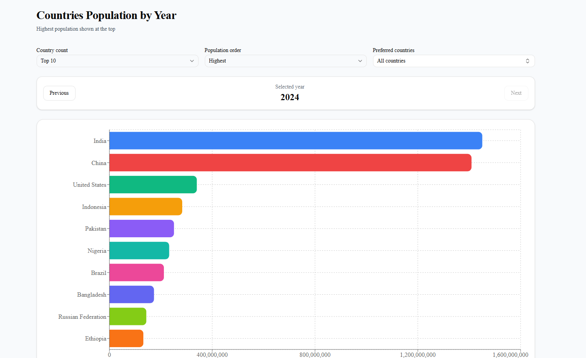

# Population Ranking Chart

This project is a Next.js application that visualizes country population data using a bar chart.  
The application retrieves population statistics from a public data source and displays the most populated countries for a selected year.

---

## Features

- Display population data using a horizontal bar chart
- Countries ranked from **highest to lowest population**
- Show **Top 10 countries by default**
- Option to switch between **Top 10 and Top 15 countries**
- Navigate between years using **Previous / Next controls**
- Unique color for each country bar
- Data fetched dynamically from a public API

---

## Data Source

Population data is retrieved from the **World Bank Open Data API**.

API Endpoint: https://api.worldbank.org/v2/country/all/indicator/SP.POP.TOTL

## Technologies Used

- **Next.js**
- **React**
- **TypeScript**
- **React Query**
- **TailwindCSS**
- **Recharts**

---
